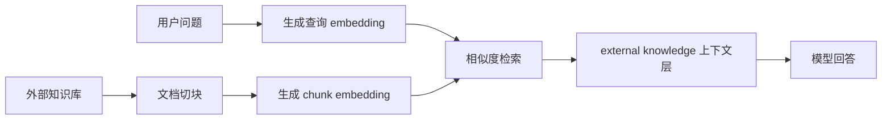

上一章我们讲 Context Engineering 时，最后留下了一个位置：

> external knowledge：外部知识片段。

这一章就专门补上这块。

Agent 经常会遇到模型参数里没有的信息：

- 公司内部文档
- 项目最新 README
- 产品策略说明
- API 使用规范
- 用户上传的资料
- 代码库里刚刚改过的文件

这些信息不能指望模型“本来就知道”。
也不应该把整套资料都塞进 prompt。

RAG 要解决的就是这个问题：

> 在回答之前，先从外部知识库里找出当前问题需要的片段，再把这些片段放进上下文。

RAG 是 Retrieval-Augmented Generation。
翻成工程流程就是：

```txt
用户问题 -> 检索相关资料 -> 把资料放进上下文 -> 让模型基于资料回答
```

一讲到“检索相关资料”，很多 RAG 教程会马上跳到向量数据库。

注意这里的重点不是“向量数据库”。
向量数据库只是实现检索的一种基础设施。

这一章先不引入 LangChain、LlamaIndex 或向量数据库。
我们会保留一个真实的 embedding 调用，但把切块、相似度排序、top-k 检索和上下文注入都手写出来。

这样做不是因为生产系统都应该手写 RAG。
而是因为入门阶段应该先看清楚 RAG 每一步到底在做什么。

## RAG 在 Agent 里的位置

普通模型调用大概是这样：

```txt
用户问题 -> 模型 -> 回答
```

接入 RAG 后，中间多了一层外部知识获取：



从 Agent 的角度看，RAG 不是独立于上下文工程的东西。

它只是回答了一个更具体的问题：

> 当前上下文缺少外部知识时，应该去哪里找？找到后应该怎么放回来？

所以本章会沿着这个闭环写：

1. 准备一份外部知识库
2. 把文档切成 chunk
3. 为 chunk 生成 embedding
4. 把用户问题也生成 embedding
5. 用相似度找出 top-k chunk
6. 把检索结果注入 Agent 上下文
7. 让模型只基于这些资料回答

## 为什么不直接把整篇文档塞进去

最直接的方案是：

> 把所有文档内容都放进 prompt。

小 demo 里这样做可能能跑。
但它很快会出问题。

第一，文档会超过上下文窗口。
第二，不相关内容会稀释重点。
第三，模型容易把不同段落混在一起。
第四，回答很难追溯来源。

更糟糕的是，这种做法会把“找资料”的责任丢给模型。

RAG 的思路相反：

> 系统先找出最相关的资料，再让模型基于这几段资料回答。

这和上一章的 Context Engineering 是同一个原则：

好的上下文不是信息最多，而是信息最贴近当前任务。

## 本章示例

这一章对应的可运行代码在 [rag-agent.ts](https://github.com/leondt1/ai-agent-tutorial/blob/main/examples/07-rag/rag-agent.ts)。

知识库样本在 [knowledge-base.md](https://github.com/leondt1/ai-agent-tutorial/blob/main/examples/07-rag/knowledge-base.md)。

运行命令：

```bash
pnpm example examples/07-rag/rag-agent.ts
```

也可以传入自己的问题：

```bash
pnpm example examples/07-rag/rag-agent.ts "为什么 RAG 不等于把整篇文档塞进 prompt？"
```

示例会依次打印：

- 用户问题
- 切出来的 chunk
- embedding 步骤
- top-k 检索结果
- 注入模型前的 RAG context
- 最终回答

这个示例需要 `.env.local` 里有可用的 `OPENAI_API_KEY`。
如果你使用自定义兼容服务，也可以配置 `OPENAI_BASE_URL`。

默认使用：

```txt
OPENAI_MODEL=gpt-5-mini
OPENAI_EMBEDDING_MODEL=text-embedding-3-small
```

这里第一次出现了两个模型配置。

`OPENAI_MODEL` 是前面章节已经见过的生成模型，负责最后阅读 RAG context 并写出回答。
`OPENAI_EMBEDDING_MODEL` 是这一章新出现的 embedding 模型，负责把文档 chunk 和用户问题转成向量，让程序可以比较它们的语义相似度。

也就是说，RAG 示例里会用到两个不同用途的模型：

- 生成模型：读上下文、生成自然语言回答
- embedding 模型：把文本转成向量、支持检索

## 准备外部知识库

示例先准备一份很小的 Markdown 知识库：

```md
# TypeScript Agent Assistant Knowledge Base

这份知识库模拟一个项目内部文档。第 07 章会把它当作模型参数之外的外部知识来源。

## Context Engineering

Context Engineering 负责决定模型每一轮应该看到什么信息。它会把系统规则、用户目标、当前状态、历史消息、工具观察和外部知识组织成清楚的上下文层。

好的上下文不是越长越好，而是要让模型知道当前任务是什么、任务执行到哪一步、回答依据来自哪里，以及哪些旧信息已经不再重要。

## RAG

RAG 是 Retrieval-Augmented Generation 的缩写。它的重点不是让模型永久记住新知识，而是在回答前从外部知识库里检索当前问题需要的片段，再把这些片段作为上下文提供给模型。

在 Agent 里，RAG 通常不是一个独立终点，而是 Context Engineering 的一个知识来源。检索结果需要带上来源、片段内容和相关性信息，然后进入上下文里的 external knowledge 层。

## Chunking

文档切块会直接影响检索质量。如果 chunk 太大，里面会混入很多和问题无关的内容；如果 chunk 太小，模型可能看不到完整语义。

一个适合入门示例的做法是按 Markdown 二级标题切块。这样每个 chunk 通常对应一个完整主题，既比整篇文档更聚焦，也比单句切分更容易保留上下文。

## Embedding Retrieval

Embedding 会把文本转换成向量。查询和文档片段都转换成向量后，可以用 cosine similarity 计算它们的相似度。

最小 RAG 可以只做 top-k retrieval：把所有 chunk 按相似度排序，取最相关的几个片段。真实系统还可能继续加入 reranking、权限过滤、增量索引和向量数据库。

## Grounded Answering

RAG 检索到片段以后，Agent 不应该直接把它们当作最终答案。系统需要把片段注入上下文，并要求模型只根据给定资料回答。

回答中最好带上来源引用。引用不是装饰，它让用户和系统都能检查结论是否真的来自检索结果。

## When To Use A RAG Framework

LangChain、LlamaIndex 和向量数据库适合生产系统，尤其是文档多、更新频繁、需要权限过滤或复杂检索策略的时候。

但在教学和早期原型里，先手写一个最小 RAG 链路更容易理解。读者应该先看清楚文档切块、embedding、相似度排序、top-k 检索和上下文注入分别在做什么，再决定要不要换成框架。
```

真实系统里的知识库可能来自数据库、PDF、网页、代码仓库或用户上传文件。

但对这一章来说，来源不重要。
重要的是先有一份“模型参数之外的原始资料”。

下一步才是把这份原始资料切成更小的、可以被检索的片段。

## 文档如何切块

RAG 的第一步通常不是 embedding，而是切块。

因为模型最终拿到的不是“整篇文档”，而是“若干个检索出来的片段”。

在代码里，这样的片段会用 `DocumentChunk` 表示：

```ts
type DocumentChunk = {
  id: string;
  source: string;
  title: string;
  content: string;
};
```

每个 chunk 至少要有四类信息：

- `id`：片段标识
- `source`：来源路径
- `title`：片段主题
- `content`：片段内容

这几个字段会在后面继续使用。
特别是 `source` 和 `id`，它们会成为回答引用的基础。

切块质量会直接影响检索质量。

如果 chunk 太大，一个片段里可能混着多个主题。
用户问 RAG，检索结果里却同时带着 MCP、Skill 和部署说明。
模型虽然拿到了资料，但噪音很多。

如果 chunk 太小，一个片段可能只有一句话。
它看起来相关，但缺少上下文。
模型可能不知道这句话属于哪个概念、哪个场景、哪个限制条件。

本章示例用一个很朴素的策略：

> 按 Markdown 二级标题切块。

代码在 `chunkMarkdown()`：

```ts
function chunkMarkdown(source: string, markdown: string): DocumentChunk[] {
  const chunks: DocumentChunk[] = [];
  const lines = markdown.split(/\r?\n/);
  let currentTitle = "Introduction";
  let currentLines: string[] = [];

  function flushChunk() {
    const content = currentLines.join("\n").trim();

    if (!content) {
      return;
    }

    const id = `chunk-${chunks.length + 1}`;

    chunks.push({
      id,
      source,
      title: currentTitle,
      content,
    });
  }

  for (const line of lines) {
    const heading = line.match(/^##\s+(.+)$/);

    if (heading) {
      flushChunk();
      currentTitle = heading[1]?.trim() || "Untitled";
      currentLines = [line];
      continue;
    }

    currentLines.push(line);
  }

  flushChunk();

  return chunks;
}
```

这不是最强的切块策略。
但在这个示例里，它很容易观察：

> 每个 chunk 都对应一个清楚的主题。

这样后面做相似度检索时，你能直观看到模型为什么选中某个片段。
切块不是单纯的预处理细节，它会直接影响检索质量。

## 生成 embedding

切好 chunk 后，下一步是让程序能判断：

> 用户问题和哪个 chunk 最相关？

程序不能直接理解一段文字的“意思”。
所以 RAG 通常会先把文本交给 embedding 模型，得到一个数字数组。
这个数字数组就叫 embedding。

你可以先把 embedding 理解成：

> 一段文本在语义空间里的坐标。

两个文本意思越接近，它们的坐标通常也越接近。
这样程序就可以用数学方法比较“语义相似度”。

示例里的 `embedChunks()` 负责把每个文档片段都变成这种可比较的形式：

```ts
async function embedChunks(chunks: DocumentChunk[]): Promise<EmbeddedChunk[]> {
  const response = await client.embeddings.create({
    model: embeddingModel,
    input: chunks.map((chunk) => `${chunk.title}\n${chunk.content}`),
  });

  return chunks.map((chunk, index) => ({
    ...chunk,
    embedding: response.data[index]?.embedding ?? [],
  }));
}
```

这段代码分三步：

1. 把每个 chunk 的 `title` 和 `content` 拼成一段输入文本
2. 调用 `client.embeddings.create()`，让 `OPENAI_EMBEDDING_MODEL` 把文本转成向量
3. 把返回的 `embedding` 存回对应的 chunk 上

返回值类型是 `EmbeddedChunk[]`。
它比原来的 `DocumentChunk` 多了一个字段：

```ts
type EmbeddedChunk = DocumentChunk & {
  embedding: number[];
};
```

从这一刻开始，每个 chunk 不只有可读的文本内容，也有一份可计算的向量表示。

注意输入里同时放了 `title` 和 `content`：

```ts
input: chunks.map((chunk) => `${chunk.title}\n${chunk.content}`),
```

标题通常比正文更能概括主题，把它一起送进 embedding，可以让 chunk 的语义更清楚。

## 查询也要 embedding

只给文档生成 embedding 还不够。

用户问题也要转成向量：

```ts
const response = await client.embeddings.create({
  model: embeddingModel,
  input: question,
});

const queryEmbedding = response.data[0]?.embedding ?? [];
```

现在我们有两类向量：

- query embedding：用户问题
- chunk embedding：文档片段

接下来就可以做相似度排序。

## 用 cosine similarity 排序

现在问题变成了：

> 两个 embedding 向量有多相似？

`cosineSimilarity` 是一种常见的相似度计算方式。
它比较的是两个向量的方向是否接近，而不是只看向量的长度。

你可以先这样理解：

- 两个向量方向越接近，分数越高
- 两个向量方向越不相关，分数越低
- 在这个示例里，分数越高，说明 chunk 越可能和用户问题相关

相似度计算不只有这一种。
常见选择还包括 dot product、Euclidean distance 和 Manhattan distance。

这个示例选择 cosine similarity，是因为它很适合入门理解 embedding 检索：
我们关心的是“语义方向是否接近”，而不是某个向量本身有多长。
很多向量检索系统也会支持 cosine similarity，所以先手写它，后面换成向量数据库时概念也能接上。

代码里手写了一个 `cosineSimilarity()`：

```ts
function cosineSimilarity(left: number[], right: number[]) {
  if (left.length === 0 || left.length !== right.length) {
    return 0;
  }

  let dotProduct = 0;
  let leftNorm = 0;
  let rightNorm = 0;

  for (let index = 0; index < left.length; index += 1) {
    const leftValue = left[index] ?? 0;
    const rightValue = right[index] ?? 0;

    dotProduct += leftValue * rightValue;
    leftNorm += leftValue * leftValue;
    rightNorm += rightValue * rightValue;
  }

  if (leftNorm === 0 || rightNorm === 0) {
    return 0;
  }

  return dotProduct / (Math.sqrt(leftNorm) * Math.sqrt(rightNorm));
}
```

然后把所有 chunk 排序，取前几个：

```ts
return chunks
  .map((chunk) => ({
    chunk,
    score: cosineSimilarity(queryEmbedding, chunk.embedding),
  }))
  .sort((left, right) => right.score - left.score)
  .slice(0, topK);
```

这就是最小 top-k retrieval。

它很朴素，但已经具备 RAG 的核心形状：

> 不是把所有资料给模型，而是先按问题找出最相关的几个片段。

真实系统里，这里可能会继续加入：

- metadata filter：按权限、时间、文档类型过滤
- reranker：让更强模型重新排序候选片段
- hybrid search：同时使用关键词检索和向量检索
- vector database：把向量索引持久化并加速搜索

但这些都不是第一章 RAG 示例必须出现的东西。

## 把检索结果放回上下文

检索出 top-k chunk 后，还没有结束。

RAG 最容易被误解的一点是：

> 检索结果不是答案，它只是上下文。

所以示例用 `buildRagContext()` 把检索结果整理成一个明确的上下文层：

```ts
function buildRagContext(question: string, results: RetrievalResult[]) {
  const retrievedKnowledge = results
    .map((result, index) => {
      const rank = index + 1;
      const score = result.score.toFixed(3);

      return [
        `[${rank}] source: ${result.chunk.source}#${result.chunk.id}`,
        `title: ${result.chunk.title}`,
        `score: ${score}`,
        result.chunk.content,
      ].join("\n");
    })
    .join("\n\n");

  return [
    "## task",
    question,
    "",
    "## external knowledge",
    retrievedKnowledge,
  ].join("\n");
}
```

这里保留了三个关键信息：

- `source`：片段来自哪里
- `title`：片段主题是什么
- `score`：片段和问题大概有多相关

注意：`score` 不应该被当成事实来源。
它只是检索排序信号。

真正可以被引用的是 `source` 和 `content`。

## 让模型基于资料回答

最后一步才是生成回答：

```ts
const response = await client.chat.completions.create({
  model,
  messages: [
    {
      role: "system",
      content:
        "你是一个工程教程助手。只能根据用户提供的 external knowledge 回答；如果资料不足，请说明不知道。回答要简洁，并在关键结论后引用 source。",
    },
    {
      role: "user",
      content: context,
    },
  ],
});
```

这个 system message 很重要。

它要求模型：

- 只能根据 `external knowledge` 回答
- 资料不足时要承认不知道
- 关键结论后带来源

RAG 不能保证模型永远不幻觉。
但它至少提供了一个更可检查的回答边界：

> 结论应该能回到检索片段里找到依据。

## 运行结果怎么看

默认运行示例时，问题是：

```txt
RAG 和 Context Engineering 是什么关系？什么时候需要引入 RAG 框架？
```

你会先看到切块结果：

```txt
chunk-1: Introduction
chunk-2: Context Engineering
chunk-3: RAG
chunk-4: Chunking
...
```

然后看到检索结果：

```txt
1. RAG score=0.62 source=examples/07-rag/knowledge-base.md#chunk-3
2. Context Engineering score=0.55 source=examples/07-rag/knowledge-base.md#chunk-2
3. When To Use A RAG Framework score=0.51 source=examples/07-rag/knowledge-base.md#chunk-7
```

分数每次可能略有不同。
重要的不是具体数字，而是排序是否符合直觉。

接着示例会打印注入模型前的上下文：

```txt
## task
RAG 和 Context Engineering 是什么关系？什么时候需要引入 RAG 框架？

## external knowledge
[1] source: examples/07-rag/knowledge-base.md#chunk-3
title: RAG
score: 0.620
...
```

这一步很值得停下来观察。

RAG 的关键不是“模型最后说了什么”，而是“模型回答前看到了什么”。

如果这里检索错了，后面再好的 prompt 也很难稳定回答。

## 要不要使用 RAG 开源库

到这里可以回答一个常见问题：

> RAG 这么复杂，要不要直接用开源库？

答案是：生产系统里经常应该用，但本章不先用。

LangChain、LlamaIndex、向量数据库和托管检索服务都很有价值。
当你的系统出现这些需求时，就应该认真考虑引入：

- 文档很多，不能每次在内存里全量扫描
- 知识库经常更新，需要增量索引
- 不同用户有不同权限，需要检索前过滤
- 需要混合检索、reranking、评测和观测
- 需要接入 PDF、网页、数据库等多种数据源

但在学习阶段，如果一开始就使用完整框架，读者很容易只看到几个 API：

```ts
const retriever = vectorStore.asRetriever();
const chain = createRetrievalChain(...);
```

代码确实短了。
但 RAG 的关键动作也被藏起来了。

所以本章只保留 OpenAI SDK：

- embedding 调用交给模型服务
- chunking 手写
- similarity 手写
- top-k retrieval 手写
- context formatting 手写

等读者理解这条链路后，再使用框架时就会知道：

> 框架是在替我管理哪些步骤？我应该如何检查每一步是否做对？

## 本章小结

RAG 的本质不是“给模型装一个知识库”。

它更像是 Agent 的一个上下文补充机制：

1. 当前问题需要外部知识
2. 系统从知识库里找出相关片段
3. 检索结果带着来源进入上下文
4. 模型基于这些片段生成回答
5. 用户可以沿着引用检查依据

这一章的最小实现还很简单。
它没有向量数据库，没有 reranker，也没有复杂文档解析。

但它已经包含了 RAG 最重要的闭环：

```txt
chunk -> embed -> retrieve -> format context -> answer with sources
```

下一章我们会换一个角度继续扩展 Agent：

> 当外部能力越来越多时，如何用 MCP 让工具接入变得标准化。
