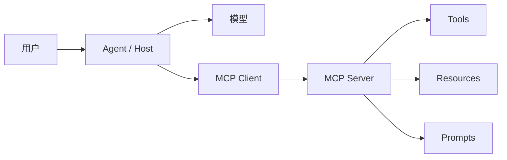
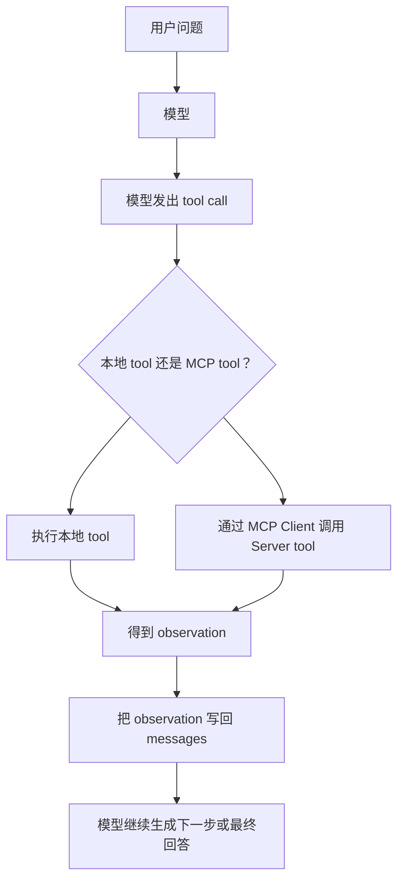

前面几章里，我们已经一步一步给 Agent 加上了能力。

第 03 章里，Agent 可以调用 `readFile` 这样的本地工具。
第 06 章里，我们开始有意识地组织上下文。
第 07 章里，RAG 把外部知识片段放进了模型上下文。

这些能力单独看都不复杂。
但当它们开始变多时，一个新的问题会出现：

> 每接一个外部系统，都要重新写一套连接、描述、调用和返回格式。

今天接文件系统。
明天接数据库。
后天接浏览器、GitHub、公司内部知识库、工单系统、部署平台。

如果每一种能力都用自己的方式暴露给 Agent，代码很快会变成一堆临时适配：

- 工具列表写在一个地方
- 资源读取写在另一个地方
- 工具参数格式各不相同
- 返回结果很难统一放回上下文
- 新增一个外部系统时，Agent 主流程也跟着改

MCP 要解决的不是“模型会不会调用工具”。
这个问题前面已经通过 Tool Calling 解决过了。

MCP 要解决的是更靠近工程接入层的问题：

> 外部工具、资源和提示模板，能不能用一种标准方式暴露给 Agent？

MCP 是 Model Context Protocol。
可以把它先理解成一个标准接入协议：

```txt
Agent 应用不直接关心每个外部系统怎么实现。
外部系统通过 MCP Server 暴露能力。
Agent 应用通过 MCP Client 发现和调用这些能力。
```

所以这一章会先写一个最小 MCP Server，再写一个最小 MCP Client。

这个示例不会直接调用大模型。
它要先回答一个更基础的问题：

> Agent 在调用模型之前，如何用标准协议发现工具、调用工具、读取资源？

等这个闭环跑通后，你再把 MCP 返回的结果接回前面的 Agent Loop，就会很自然。

## MCP 和 Tool Calling 的分工

Tool Calling 解决的是模型和 Agent 执行系统之间的接口。

在第 03 章里，模型会返回类似这样的意图：

```txt
我要调用 readFile
参数是 { "path": "README.md" }
```

然后我们的程序负责三件事：

1. 找到 `readFile` 这个本地函数
2. 真的执行它
3. 把执行结果作为 tool message 写回模型上下文

这里的问题是：

> `readFile` 从哪里来？

在第 03 章里，答案很简单：我们直接在同一个 TypeScript 文件里写了它。

这对入门很好。
读者可以从上到下看清楚完整流程。

但真实 Agent 不会只有一个 `readFile`。
它可能要接很多来源：

- 本地文件
- 项目文档
- 数据库
- API 服务
- 浏览器自动化
- 设计稿
- 内部知识库

如果这些能力都要手写进 Agent 主项目，主流程会越来越难读。

MCP 把这个问题拆开：

```txt
Tool Calling：模型如何请求调用一个能力
MCP：这个能力如何被外部系统标准化地暴露出来
```

换句话说：

> Tool Calling 解决“怎么调用”，MCP 解决“怎么接入”。

它们不是替代关系。
MCP 暴露出来的 tool，最后仍然可以被转换成模型能看懂的 tool schema，再进入 Tool Calling 流程。

## MCP 不是 Agent 本身

第一次接触 MCP 时，很容易把它想成一个新的 Agent 框架。

但它不是。

MCP 不负责决定下一步行动。
MCP 不负责规划。
MCP 不负责让模型推理。
MCP 也不会自动保证答案正确。

它更像 Agent 系统里的接入层。



这里有几个角色需要先分清楚。

**Host** 是运行 Agent 的应用。
例如 IDE、桌面助手、聊天应用、自动化平台，或者你自己写的 Agent 程序。

**Client** 是 Host 里面负责连接某个 MCP Server 的对象。
一个 Host 可以同时连接多个 MCP Server。

**Server** 是暴露外部能力的一端。
它可以是本地进程，也可以是远程服务。

**Transport** 是 Client 和 Server 之间的通信方式。
本章用最适合本地教学的 stdio。
也就是 Client 启动一个本地 Server 进程，然后通过标准输入输出通信。

**Tool** 是模型可以主动调用的函数。
它适合搜索航班、发送消息、写数据库、调用外部 API、修改文件这类动作。
是否调用 tool，通常由模型根据用户请求来决定。

**Resource** 是应用可以读取的被动数据源。
它适合文件内容、知识库、数据库 schema、API 文档这类只读上下文。
是否读取 resource，通常由 Host 应用决定。

**Prompt** 是预先构建好的指令模板。
它告诉模型如何配合某些 tools 和 resources 完成一类任务。
是否使用 prompt，通常由用户显式选择。

这三个对象都是 MCP Server 可以提供的功能。
它们最重要的区别，不只是“长得像什么”，而是谁来控制它们。

## Tool、Resource、Prompt 有什么区别

这三个概念很容易混在一起。

官方文档给了一个很实用的区分方式：

> 这个能力主要由谁控制？

| MCP Server feature | 它是什么 | 例子 | 谁控制它 |
| --- | --- | --- | --- |
| Tool | 模型可以主动调用的函数，用来执行动作或触发逻辑 | 搜索航班、发送消息、创建日历事件 | 模型 |
| Resource | 被动数据源，为上下文提供只读信息 | 检索文档、读取知识库、访问 API 文档 | 应用 |
| Prompt | 预先构建好的指令模板，告诉模型如何使用特定 tools 和 resources | 规划旅行、总结会议、起草邮件 | 用户 |

举几个例子。

读取 `README.md` 可以做成 Tool。
如果用户问“帮我看 README 里有没有安装步骤”，模型可以主动决定调用这个 tool。

项目规范文档可以做成 Resource。
它更像一份只读上下文资料，由应用决定什么时候读、读多少、如何放进上下文。

“请先调用章节摘要 tool，再读取章节说明 resource，最后综合解释这一章”可以做成 Prompt。
它不是一个外部动作，也不是一份资料，而是用户选择的一段任务模板。
这段模板告诉模型应该如何配合特定 tool 和 resource 完成任务。

这三个角色放在一起，才构成一个更完整的接入层：

```txt
Tool：模型控制，主动调用函数做事
Resource：应用控制，读取只读资料补上下文
Prompt：用户控制，用预设模板发起一类任务
```

## 本章示例

本章对应的可运行代码在 [examples/08-mcp/](https://github.com/leondt1/ai-agent-tutorial/tree/main/examples/08-mcp) 目录下。

这次有两个 TypeScript 文件：

- [tutorial-mcp-server.ts](https://github.com/leondt1/ai-agent-tutorial/blob/main/examples/08-mcp/tutorial-mcp-server.ts)：暴露一个最小 MCP Server
- [mcp-client.ts](https://github.com/leondt1/ai-agent-tutorial/blob/main/examples/08-mcp/mcp-client.ts)：连接这个 Server，并调用它暴露的能力

运行命令：

```bash
pnpm example examples/08-mcp/mcp-client.ts
```

示例会依次打印：

- MCP Server 信息
- Server 暴露的 tools
- Server 暴露的 resources
- Server 暴露的 prompts
- 一次 tool 调用结果
- 一次 resource 读取结果
- 一次 prompt 获取结果

这一章需要安装 MCP TypeScript SDK：

```bash
pnpm add @modelcontextprotocol/sdk
```

示例不需要 `OPENAI_API_KEY`。
因为这一章先只看 MCP 的接入闭环，不把模型调用混进来。

## 先写一个最小 MCP Server

Server 文件是 [tutorial-mcp-server.ts](https://github.com/leondt1/ai-agent-tutorial/blob/main/examples/08-mcp/tutorial-mcp-server.ts)。

它的职责很简单：

1. 创建一个 MCP Server
2. 注册一个 tool
3. 注册一个 resource
4. 注册一个 prompt
5. 通过 stdio transport 等待 client 连接

文件开头先导入 SDK：

```ts
import { McpServer } from "@modelcontextprotocol/sdk/server/mcp.js";
import { StdioServerTransport } from "@modelcontextprotocol/sdk/server/stdio.js";
import { z } from "zod";
```

`McpServer` 是 SDK 提供的高层 Server API。
`StdioServerTransport` 让这个 Server 可以作为本地子进程被 Client 启动。
`zod` 用来描述和校验 tool 输入参数。

接着创建 Server：

```ts
const server = new McpServer({
  name: "tutorial-mcp-server",
  version: "0.1.0",
});
```

这里的 `name` 和 `version` 会在 Client 初始化后被读到。
它们不是给模型看的自然语言提示，而是协议层的 Server 信息。

### 注册一个 Tool

本章的 tool 叫 `getChapterSummary`。

它接收一个章节编号，例如 `"08"`，返回这个章节的简短说明。

```ts
server.registerTool(
  "getChapterSummary",
  {
    title: "Get chapter summary",
    description: "Return a short summary for one tutorial chapter.",
    inputSchema: {
      code: z.string().describe("Chapter code, for example 03, 07, or 08."),
    },
  },
  ({ code }) => {
    const chapter = chapters[code];

    if (!chapter) {
      return {
        isError: true,
        content: [
          {
            type: "text",
            text: `No chapter found for code ${code}.`,
          },
        ],
      };
    }

    return {
      content: [
        {
          type: "text",
          text: `${chapter.title}\n\n${chapter.summary}`,
        },
      ],
    };
  },
);
```

这段代码和第 03 章的本地 tool 有一个明显差别：

第 03 章里，tool 直接写在 Agent 进程里。
这一章里，tool 写在 MCP Server 进程里。

Agent 想用它时，不需要知道 `chapters` 对象在哪里。
它只需要通过 MCP Client 发起：

```txt
callTool: getChapterSummary
arguments: { code: "08" }
```

Server 收到请求后执行真实逻辑，再把结果按 MCP 的格式返回。

### 注册一个 Resource

Tool 强调动作。
Resource 强调资料。

本章的 resource URI 是：

```txt
tutorial://chapters/08
```

它代表“第 08 章的教学说明”。

```ts
server.registerResource(
  "chapter-08-note",
  "tutorial://chapters/08",
  {
    title: "Chapter 08 note",
    description: "A short note about how MCP fits into the tutorial.",
    mimeType: "text/markdown",
  },
  (uri) => ({
    contents: [
      {
        uri: uri.href,
        mimeType: "text/markdown",
        text: chapter08Resource,
      },
    ],
  }),
);
```

注意这里没有输入参数。

Client 只要知道这个 URI，就可以读取对应资源。

这和 RAG 有一个连接点：

> MCP Resource 可以成为外部知识来源，但 MCP 本身不是 RAG。

RAG 关心的是：

```txt
如何检索相关资料 -> 如何把资料注入上下文 -> 如何让模型基于资料回答
```

MCP Resource 关心的是：

```txt
这份资料如何被标准化暴露和读取
```

在真实系统里，你可以让 MCP Server 暴露文档、代码片段、数据库记录或知识库条目。
然后 Agent 再决定这些资料是直接放进上下文，还是进入 RAG 检索流程。

### 注册一个 Prompt

前面你已经见过两类 MCP 能力：

Tool 负责执行动作。
Resource 负责提供资料。

Prompt 解决的是另一个问题：

> 当用户经常要发起同一类任务时，能不能把“该如何使用这些 tools 和 resources”的指令模板复用起来？

在这个例子里，用户想要发起一个固定任务：

> 用 `getChapterSummary` tool 拿章节摘要，再读取 `tutorial://chapters/08` resource 拿补充说明，最后综合两者解释这一章。

这段顺序本身不适合做成 Tool。
因为它不是一个外部动作。

它也不适合做成 Resource。
因为它不是一份资料。

它更适合做成 Prompt：一段用户可以选择的指令模板，告诉模型应该如何配合特定 tool 和 resource 完成任务。

```ts
server.registerPrompt(
  "explainChapterWithMcp",
  {
    title: "Explain a chapter with MCP",
    description: "Create a task prompt that combines the chapter summary tool and chapter resource.",
    argsSchema: {
      code: z.string().describe("Chapter code, for example 08."),
      resourceUri: z.string().describe("Resource URI to read for extra context."),
    },
  },
  ({ code, resourceUri }) => ({
    messages: [
      {
        role: "user",
        content: {
          type: "text",
          text: [
            `请解释第 ${code} 章在教程中的作用。`,
            "",
            "请按这个顺序组织上下文：",
            `1. 调用 getChapterSummary tool，参数为 { "code": "${code}" }，拿到章节摘要。`,
            `2. 读取 ${resourceUri} resource，拿到补充说明。`,
            "3. 综合 tool 结果和 resource 内容，用三句话解释这一章为什么需要 MCP。",
          ].join("\n"),
        },
      },
    ],
  }),
);
```

这个 Prompt 不会自己调用模型，也不会自己执行 `getChapterSummary`。

它只是返回一段结构化消息，告诉模型这次任务应该怎样使用 MCP Server 暴露的能力：

1. 需要哪个 tool
2. 需要哪个 resource
3. 拿到这些上下文以后要生成什么结果

在真实产品里，这通常由用户触发。
比如用户在界面里选择“解释一个教程章节”这个 prompt，Host 再向 MCP Server 获取模板，并把模板交给模型。

所以 Prompt 更像用户可选的任务模板，不是执行器。

Tool 和 Resource 是能力本身。
Prompt 是指导模型使用这些能力的任务说明。

### 通过 stdio 启动 Server

Server 最后需要连接 transport：

```ts
const transport = new StdioServerTransport();
await server.connect(transport);
```

这行代码会让 Server 开始通过标准输入输出收发 MCP 消息。

有一个细节很重要：

> stdio MCP Server 不应该随便向 stdout 打印日志。

因为 stdout 是协议通信通道。
如果你把调试日志打印到 stdout，Client 可能会把它当成协议消息解析。

如果要调试，应该写到 stderr，或者使用 SDK 提供的日志能力。
本章示例为了保持安静，Server 不打印任何日志。

## 再写一个 MCP Client

Client 文件是 [mcp-client.ts](https://github.com/leondt1/ai-agent-tutorial/blob/main/examples/08-mcp/mcp-client.ts)。

它的职责是：

1. 创建 MCP Client
2. 用 stdio 启动并连接本章的 Server
3. 列出 tools、resources、prompts
4. 调用 tool
5. 读取 resource
6. 获取 prompt
7. 关闭连接

先创建 Client：

```ts
const client = new Client({
  name: "tutorial-mcp-client",
  version: "0.1.0",
});
```

然后准备 stdio transport：

```ts
const transport = new StdioClientTransport({
  command: "pnpm",
  args: ["exec", "tsx", serverPath],
  cwd: repositoryRoot,
  stderr: "pipe",
});
```

这段代码的意思是：

```txt
Client 会启动一个本地子进程：
pnpm exec tsx examples/08-mcp/tutorial-mcp-server.ts
```

然后通过这个子进程的 stdin/stdout 和 Server 通信。

真正建立连接的是：

```ts
await client.connect(transport);
```

`connect` 会完成 MCP 初始化流程。
连接完成后，Client 就可以知道 Server 暴露了哪些能力。

### 发现 Server 暴露的能力

Client 可以列出 tools：

```ts
const tools = await client.listTools();
```

也可以列出 resources：

```ts
const resources = await client.listResources();
```

还可以列出 prompts：

```ts
const prompts = await client.listPrompts();
```

这一步是 MCP 和手写本地工具的一个关键差别。

手写工具时，Agent 项目自己维护工具列表。

MCP 接入后，外部 Server 可以自己声明：

- 我有哪些 tools
- 每个 tool 需要什么参数
- 我有哪些 resources
- 每个 resource 的 URI 是什么
- 我有哪些 prompts

Host 不需要提前把所有能力写死在一个文件里。
它可以在连接 Server 后动态发现这些能力。

### 调用 Tool

发现工具以后，Client 可以调用：

```ts
const toolResult = await client.callTool({
  name: "getChapterSummary",
  arguments: {
    code: "08",
  },
});
```

这一步对应到前面章节就是：

```txt
运行 tool -> 得到 observation -> 放回上下文
```

只不过这次 tool 不在 Agent 本地。
它在 MCP Server 后面。

返回结果里会有 `content`：

```ts
[
  {
    type: "text",
    text: "MCP，用标准协议接入工具与资源\n\nTool Calling 解决的是...",
  },
];
```

如果你的 Agent 要把这个结果接给模型，可以把它格式化成 tool observation。

### 读取 Resource

Resource 的读取方式也很直接：

```ts
const resourceResult = await client.readResource({
  uri: "tutorial://chapters/08",
});
```

返回结果里会有 `contents`：

```ts
[
  {
    uri: "tutorial://chapters/08",
    mimeType: "text/markdown",
    text: "## MCP 在本教程里的位置...",
  },
];
```

这份内容可以进入上下文，也可以作为 RAG 的原始资料来源。

重点还是那句话：

> MCP 负责标准化读取，RAG 负责检索和注入。

### 获取 Prompt

在真实应用里，Prompt 通常是用户显式选择的。

比如界面上有一个“解释教程章节”的入口。
用户选择它以后，Host 才去 MCP Server 获取对应模板。

本章示例里没有做用户界面，所以用 Client 代码直接模拟这次用户选择：

Prompt 的获取方式是：

```ts
const promptResult = await client.getPrompt({
  name: "explainChapterWithMcp",
  arguments: {
    code: "08",
    resourceUri: "tutorial://chapters/08",
  },
});
```

返回的是一组 messages。

这组 messages 里不会直接包含 tool 执行结果。
它描述的是“这类任务应该如何组装上下文”：

```txt
先调用 getChapterSummary
再读取 tutorial://chapters/08
最后综合 tool 结果和 resource 内容解释章节作用
```

Host 可以把这段 messages 继续交给模型，让模型决定下一步 tool call。
也可以由 Host 自己按照这个模板先调用 tool、读取 resource，再把结果追加到上下文里。

这就和第 06 章的 Context Engineering 接上了：

> Prompt 不是完整上下文，它是用户选择的任务模板，用来指导模型如何使用特定 tools 和 resources。

## 把 MCP 接回 Agent Loop

本章示例只写 MCP Client，没有直接调用模型。

但它和前面的 Agent Loop 可以这样接起来：



最小 adapter 可以非常朴素：

```ts
async function runToolCall(name: string, args: unknown) {
  if (localTools[name]) {
    return localTools[name](args);
  }

  if (mcpToolNames.has(name)) {
    return client.callTool({
      name,
      arguments: args,
    });
  }

  throw new Error(`Unknown tool: ${name}`);
}
```

真实系统里，你还会继续处理：

- 多个 MCP Server 里 tool 名称冲突
- 权限控制
- 参数校验错误
- tool 调用超时
- 返回内容如何压缩进上下文
- 哪些 resource 可以被模型看到

但这些都不是本章第一步。

本章第一步只需要看清楚：

> MCP Server 暴露能力，MCP Client 发现和调用能力，Agent 再把结果放回自己的执行循环。

## MCP 和 RAG 的关系

上一章刚写完 RAG，所以这里再单独拆一下。

RAG 是一种生成前的信息获取流程。

它通常包含：

```txt
chunk -> embed -> retrieve -> format context -> answer with sources
```

MCP 不是这条流程的替代品。

MCP 可以提供 RAG 的资料来源。
例如一个 MCP Server 暴露：

- `docs://product/spec`
- `repo://current/README`
- `ticket://BUG-123`
- `database://schema/users`

Agent 可以读取这些 resources。
然后再决定：

- 直接把资源放进上下文
- 先切块再检索
- 只取其中一部分
- 根据权限过滤
- 给回答附上来源

所以两者的分工是：

```txt
MCP：外部资料和工具如何被标准化暴露
RAG：如何从资料里找出当前问题最相关的内容
```

这也是为什么本章放在 RAG 后面。

先理解外部知识如何进入上下文。
再理解外部系统如何用统一协议暴露这些知识和动作。

## MCP 的边界

MCP 让接入更标准，但它不会自动解决所有 Agent 工程问题。

第一，MCP 不自动保证工具安全。

如果一个 Server 暴露了“删除文件”“发送邮件”“部署生产环境”这样的 tool，Host 仍然需要权限控制、用户确认和审计日志。

第二，MCP 不自动保证工具设计清晰。

一个 tool 的名字、描述、参数和返回结果仍然要认真设计。
否则模型即使看到了它，也可能不知道什么时候该用，或者把参数填错。

第三，MCP 不自动决定上下文策略。

Resource 读回来以后，是否放进模型上下文、放多少、按什么格式放，仍然是 Context Engineering 的问题。

第四，MCP 不自动替你做规划。

Agent 是否应该先读资源、再调用工具、再继续询问用户，仍然由 Agent Loop、提示词、状态和执行策略共同决定。

所以 MCP 的位置应该很清楚：

```txt
它是外部能力接入层，不是 Agent 大脑。
```

## 本章小结

这一章从一个很小的 MCP Server 和 Client 开始，跑通了标准接入闭环：

1. Server 注册 tool、resource、prompt
2. Client 通过 stdio 连接 Server
3. Client 列出 Server 暴露的能力
4. Client 调用 tool
5. Client 读取 resource
6. Client 获取 prompt

现在可以把前面几章串起来看：

- Tool Calling 让模型能请求动作
- Context Engineering 决定模型每一轮应该看到什么
- RAG 从外部知识里找出当前问题需要的片段
- MCP 让外部工具和资源能用标准方式接入

到这里，Agent 已经不只是一个会调用本地函数的小循环。
它开始具备接入外部系统的工程形状。

下一章我们会继续往上走：

> 当某类任务反复出现时，如何把它沉淀成一个可复用的 Skill。
